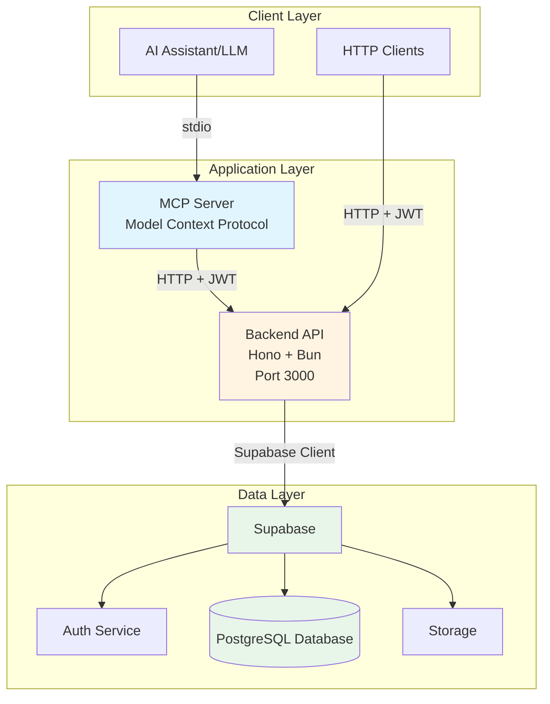
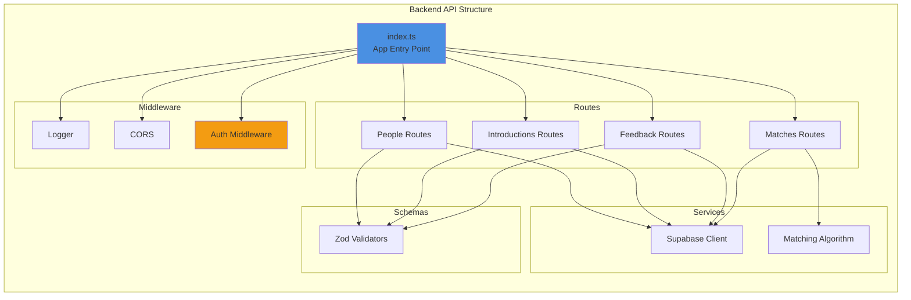
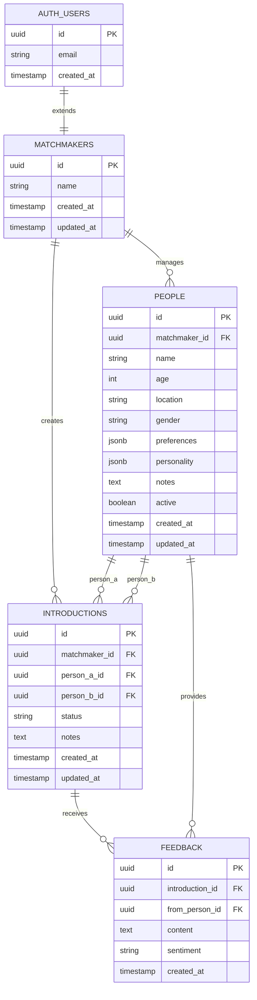
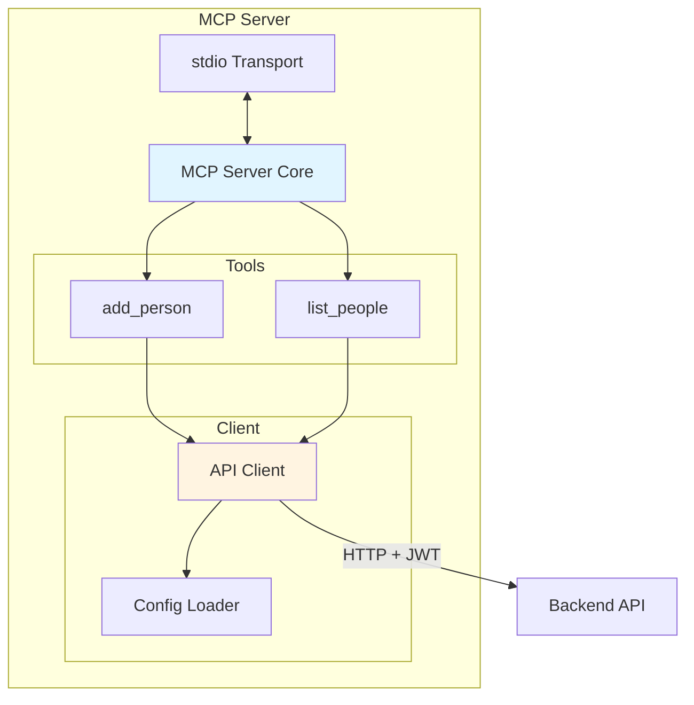
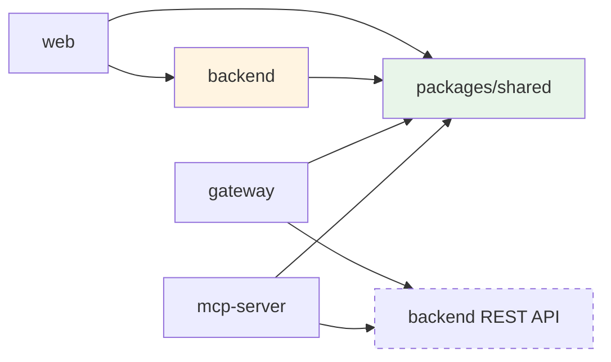
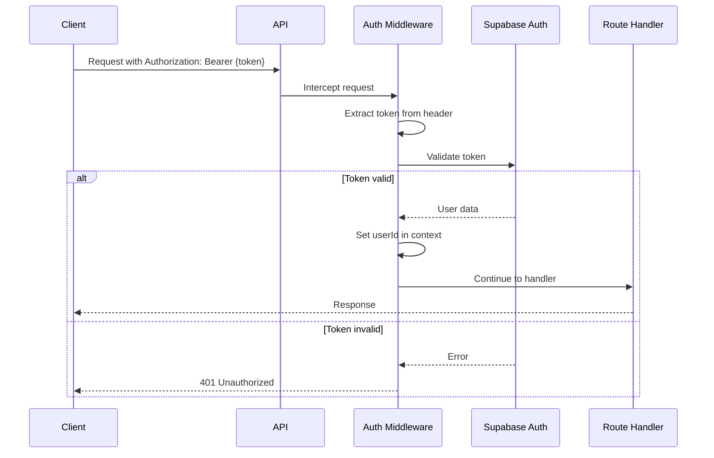
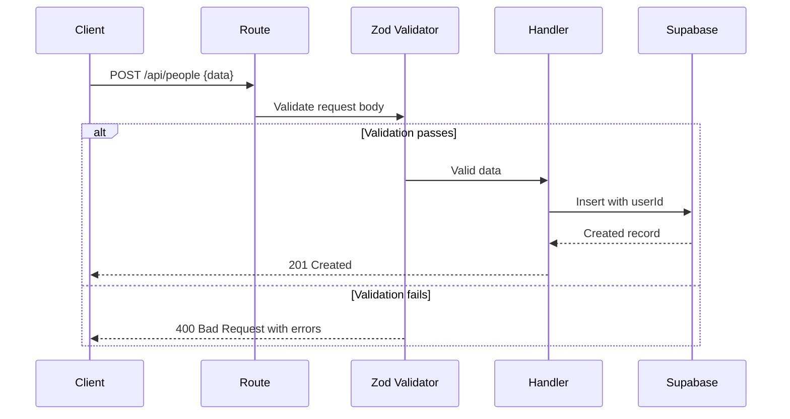

# Matchmaker System Architecture

## Overview

The Matchmaker system is an AI-powered matchmaking platform that helps matchmakers manage people, create introductions, track feedback, and find compatible matches. The system consists of three main components:

1. **Backend API** - RESTful API built with Hono and Bun
2. **Supabase** - PostgreSQL database with authentication and Row Level Security
3. **MCP Server** - Model Context Protocol server for AI integration

## System Architecture Diagram



## Component Architecture

### Backend API (Hono + Bun)

The backend is a lightweight, high-performance REST API.



**Key Features:**

- **Middleware Stack**: Logger, CORS, and JWT Authentication
- **Zod Validation**: Type-safe request validation on all endpoints
- **Service Layer**: Matching algorithm and database client abstraction
- **Environment-based Config**: Graceful handling of missing Supabase credentials

### Database Schema (Supabase/PostgreSQL)



**Security Features:**

- **Row Level Security (RLS)**: All tables protected with RLS policies
- **Authentication**: Built on Supabase Auth (extends auth.users)
- **Data Isolation**: Matchmakers can only access their own data
- **Referential Integrity**: Cascading deletes and foreign key constraints

### MCP Server (AI Integration)

The MCP server provides AI assistants with tools to interact with the matchmaker system.



**Capabilities:**

- **Tool Interface**: Exposes `add_person` and `list_people` tools
- **Authentication**: Uses JWT token from config
- **Validation**: Zod schema validation for API responses
- **Error Handling**: Graceful error propagation to AI assistant

## Package Responsibilities

This codebase is a Bun workspace with four server-side packages (`backend`, `gateway`, `mcp-server`, `packages/shared`) plus a `web` frontend. This section fixes the *inter*-package contract — what each package owns, what it must not import, and who can depend on whom — so that the Clean Architecture work in #60 has an agreed boundary to respect.

### Missions

- **`packages/shared`** — The framework-free domain core. Owns entities (`Person`, `Introduction`, `MatchDecision`, `Preferences`), repository *interfaces*, the `AuthorizationService`, and the shared MCP prompt registry. This is the dependency floor of the system: every other package may import from it, and it imports from nothing in this repo.
- **`backend`** — The authoritative HTTP API and system of record. Owns REST routes, use cases, Supabase adapters (the concrete implementations of `packages/shared`'s repository ports), JWT auth middleware, OAuth, well-known discovery, and the streamable-HTTP MCP transport served at `routes/mcp.ts`.
- **`gateway`** — Chat-orchestration edge. Receives webhooks from chat providers, parses them through a `ChatAdapter`, resolves the sender to a user, and replies. Any business state it needs is reached through `backend` over HTTP.
- **`mcp-server`** — The stdio MCP transport. A thin proxy that speaks Model Context Protocol over stdio and forwards tool calls to `backend`'s REST API via an `ApiClient`.
- **`web`** — Next.js frontend. Consumes `backend`'s REST API over HTTP.

### Anti-scope (what each package MUST NOT contain)

- **`packages/shared`**
  - No framework imports: no Hono, no Supabase client, no React, no Next.js, no chat-provider SDKs. The only external import today is `@modelcontextprotocol/sdk` type definitions used by the prompt registry.
  - No concrete repository implementations — only interfaces.
  - No I/O of any kind: no `fetch`, no filesystem, no env access.
- **`backend`**
  - No chat-provider SDKs (Slack, Twilio, Discord, etc.) — those live in `gateway` adapters.
  - No direct TypeScript imports from `mcp-server`, `gateway`, or `web`.
  - No domain logic that can't be expressed against a `packages/shared` repository interface. If Supabase types leak into a use case, the code is in the wrong layer (see #60).
- **`gateway`**
  - No direct Supabase queries. All business state goes through `backend`'s REST API.
  - No general CRUD surface — `gateway` exposes only webhook endpoints and health checks.
  - No domain logic beyond "parse, resolve, dispatch, reply."
- **`mcp-server`**
  - No direct Supabase access. Every read and write goes through `backend`'s REST API.
  - No tool logic beyond translation — if a tool needs to compute anything, the computation belongs in a `backend` use case that both MCP transports can share.
- **`web`**
  - No service-role Supabase keys in client code.
  - No business logic that duplicates a `backend` use case.

### Dependency graph

Allowed import directions (`A → B` means A may import from B):



Rules:

- `packages/shared` is a sink: it imports nothing else in this repo.
- `backend`, `gateway`, `mcp-server`, and `web` may all import from `packages/shared`.
- `gateway`, `mcp-server`, and `web` reach `backend` **only over HTTP** — never via direct TypeScript imports. This preserves the deployment boundary inside the monorepo and keeps each server independently runnable.
- No sibling-to-sibling imports. `backend → gateway`, `gateway → mcp-server`, and similar are forbidden.

### Decision log

These are the current answers to the ambiguities called out in issue #82. Revisit each one when the referenced code changes.

1. **Should MCP routing stay in `backend/src/routes/mcp.ts` or migrate to `mcp-server`?**
   **Decision: stay, but deduplicate.** `backend/routes/mcp.ts` is the *streamable-HTTP* MCP transport, served under `backend`'s auth and CORS. `mcp-server` is the *stdio* MCP transport for local AI assistants. These are two transports over the same tool set, not redundant implementations — both continue to exist. What is broken today is that tool definitions are duplicated between `backend/src/routes/mcp.ts` and `mcp-server/src/toolDefinitions.ts`. The remediation is to hoist tool metadata (names, descriptions, input schemas) into `packages/shared` and let both transports import it. Handler logic stays per-package because the stdio transport proxies over HTTP while the streamable-HTTP transport dispatches directly to use cases.

2. **When does a new feature go in `backend` vs `gateway`?**
   **Decision: `backend` by default; `gateway` only for chat-orchestration.** If the feature is a CRUD resource, a use case, a matching rule, or an authorization policy — it is `backend`. If the feature is "a new chat provider," "parsing inbound messages from channel X," or "delivering replies to Y" — it is `gateway`, and it calls `backend` over HTTP for anything stateful. Heuristic: "would a web-only user ever hit this code path?" — if yes, it belongs in `backend`.

3. **Is `mcp-server` a long-term proxy or does it absorb MCP-specific logic?**
   **Decision: long-term thin proxy.** Keeping `mcp-server` as a translation layer (stdio JSON-RPC ↔ `backend` REST) preserves a single source of truth for authorization and domain logic. The only MCP-specific concerns it should own are transport wiring and the mapping between tool names and REST calls. Anything richer — derived data, caching, tool-specific computation — belongs in a `backend` use case so both MCP transports benefit uniformly.

## Data Flow Patterns

### Authentication Flow



### Request Validation Flow



## Technology Stack

### Runtime & Framework

- **Bun**: Fast all-in-one JavaScript runtime
- **Hono**: Ultra-fast web framework (3.5KB)
- **TypeScript**: Type-safe development

### Database & Auth

- **Supabase**: PostgreSQL with built-in auth and real-time
- **Row Level Security**: Database-level authorization
- **PostgreSQL 17**: Latest stable release

### Validation & Type Safety

- **Zod**: Runtime type validation
- **@hono/zod-validator**: Integration with Hono

### AI Integration

- **@modelcontextprotocol/sdk**: MCP server implementation
- **stdio Transport**: Communication with AI assistants

## Design Principles

### 1. Security First

- JWT authentication on all protected routes
- Row Level Security at database level
- No data leakage between matchmakers
- Soft deletes (active flag) for data retention

### 2. Type Safety

- End-to-end TypeScript
- Zod schemas for runtime validation
- Type inference from schemas

### 3. Performance

- Bun runtime for speed
- Hono for minimal overhead
- Database indexes on foreign keys
- Efficient query patterns

### 4. Developer Experience

- Hot reload in development
- Comprehensive test coverage
- Clear separation of concerns
- Conventional commits

### 5. Extensibility

- Modular route structure
- Pluggable services
- MCP tools easily added
- Future-ready matching algorithm

## File Structure

```
matchmaker/
├── backend/
│   └── src/
│       ├── index.ts              # App entry point
│       ├── middleware/
│       │   └── auth.ts           # JWT authentication
│       ├── routes/
│       │   ├── people.ts         # CRUD for people
│       │   ├── introductions.ts  # CRUD for introductions
│       │   ├── feedback.ts       # CRUD for feedback
│       │   └── matches.ts        # Matching algorithm
│       ├── schemas/
│       │   ├── people.ts         # Zod schemas
│       │   ├── introductions.ts
│       │   ├── feedback.ts
│       │   └── matches.ts
│       ├── services/
│       │   └── matchingAlgorithm.ts  # Match finder
│       └── lib/
│           ├── supabase.ts       # Supabase client
│           └── utils.ts          # Utilities
├── mcp-server/
│   └── src/
│       ├── index.ts              # MCP server entry
│       ├── api.ts                # API client
│       ├── config.ts             # Config loader
│       └── schemas.ts            # Response validators
├── supabase/
│   ├── config.toml               # Supabase local config
│   ├── migrations/
│   │   ├── 20251229000000_init_matchmaker_schema.sql
│   │   └── 20251229_add_missing_schema.sql
│   └── seed.sql                  # Seed data
└── docs/
    ├── ARCHITECTURE.md           # This file
    ├── DEPLOYMENT.md
    ├── API.md
    ├── DATABASE.md
    └── FLOWS.md
```

## Key Design Decisions

### Why Hono?

- Minimal overhead (3.5KB)
- Works perfectly with Bun
- Clean middleware system
- Excellent TypeScript support

### Why Supabase?

- PostgreSQL with batteries included
- Built-in authentication
- Row Level Security
- Real-time capabilities (future use)
- Great local development experience

### Why MCP?

- Standard protocol for AI tool integration
- Allows any AI assistant to use the system
- Clean separation between AI and business logic
- Future-proof for multi-modal AI

### Why Soft Deletes?

- Maintains referential integrity
- Allows for data recovery
- Preserves historical context
- Better for auditing

## Future Enhancements

### Planned Features

1. **Advanced Matching Algorithm**

   - Personality compatibility scoring
   - Location-based filtering
   - Age preference matching
   - Historical feedback analysis

2. **Real-time Updates**

   - Supabase real-time subscriptions
   - Live introduction status updates
   - Push notifications

3. **Analytics Dashboard**

   - Success rate tracking
   - Matchmaker performance metrics
   - People activity insights

4. **Enhanced MCP Tools**

   - Create introductions via AI
   - Update introduction status
   - Query feedback sentiment
   - Get match recommendations

5. **Multi-tenant Support**
   - Organizations with multiple matchmakers
   - Team collaboration features
   - Shared people pools

## Performance Considerations

### Database Optimization

- Indexes on `matchmaker_id` for all tables
- Index on `people.active` for filtering
- Composite index on `introductions(person_a_id, person_b_id)`
- `updated_at` triggers for automatic timestamps

### API Optimization

- Minimal middleware chain
- Direct Supabase client (no ORM overhead)
- Single query per endpoint when possible
- Proper HTTP status codes for caching

### Scalability

- Stateless API (horizontally scalable)
- Connection pooling via Supabase
- Bun's performance characteristics
- Database-level authorization (reduced app logic)

## Security Considerations

### Authentication

- JWT tokens with expiration
- Supabase handles token refresh
- Bearer token in Authorization header
- No session storage needed

### Authorization

- Row Level Security enforces data isolation
- Database validates all access
- Middleware validates token
- User ID from JWT, not request body

### Input Validation

- Zod schemas on all inputs
- SQL injection protection via parameterized queries
- XSS protection via JSON responses
- CORS configured for security

## Testing Strategy

### Backend Tests

- Unit tests for matching algorithm
- Integration tests for routes
- Middleware tests for auth
- Schema validation tests

### MCP Server Tests

- Tool handler tests
- API client tests
- Config validation tests
- Error handling tests

### Database Tests

- RLS policy tests
- Migration tests
- Trigger tests
- Constraint tests
