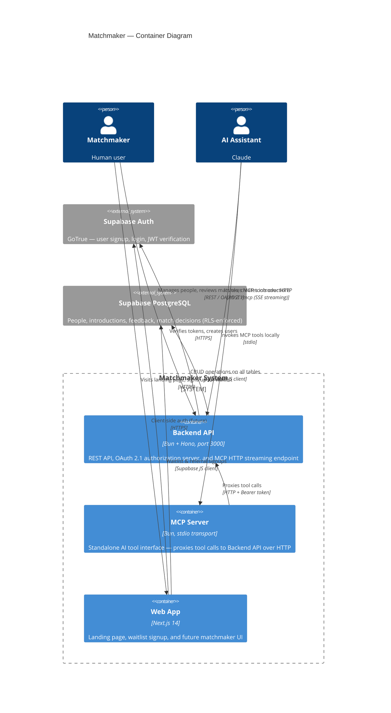

# Container Diagram

Deployable containers inside the Matchmaker system and their relationships.

```mermaid
C4Container
    title Matchmaker — Container Diagram

    Person(matchmaker, "Matchmaker", "Human user")
    Person(ai, "AI Assistant", "Claude")

    System_Boundary(system, "Matchmaker System") {
        Container(backend, "Backend API", "Bun + Hono, port 3000", "REST API, OAuth 2.1 authorization server, and MCP HTTP streaming endpoint")
        Container(mcpServer, "MCP Server", "Bun, stdio transport", "Standalone AI tool interface — proxies tool calls to Backend API over HTTP")
        Container(web, "Web App", "Next.js 14", "Landing page, waitlist signup, and future matchmaker UI")
    }

    System_Ext(supabaseAuth, "Supabase Auth", "GoTrue — user signup, login, JWT verification")
    System_Ext(supabaseDb, "Supabase PostgreSQL", "People, introductions, feedback, match decisions (RLS-enforced)")

    Rel(matchmaker, web, "Visits landing page, signs up for waitlist", "HTTPS")
    Rel(matchmaker, backend, "Manages people, reviews matches, creates introductions", "REST / OAuth 2.1")
    Rel(ai, backend, "Invokes MCP tools over HTTP", "POST /mcp (SSE streaming)")
    Rel(ai, mcpServer, "Invokes MCP tools locally", "stdio")
    Rel(mcpServer, backend, "Proxies tool calls", "HTTP + Bearer token")
    Rel(backend, supabaseAuth, "Verifies tokens, creates users", "HTTPS")
    Rel(backend, supabaseDb, "CRUD operations on all tables", "Supabase JS client")
    Rel(web, supabaseAuth, "Client-side auth (future)", "HTTPS")
    Rel(web, supabaseDb, "Waitlist & referral signups", "Supabase JS client")
```
