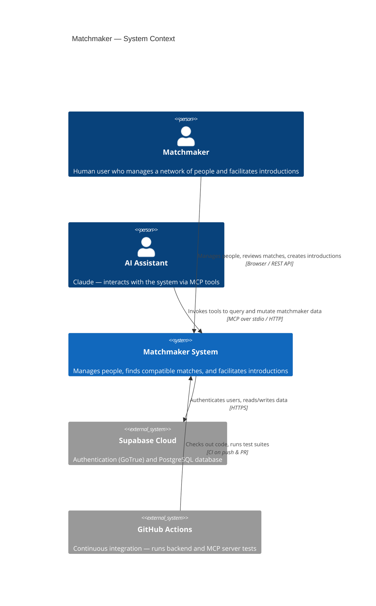

# System Context Diagram

High-level view of the Matchmaker system and its external actors and dependencies.

```mermaid
C4Context
    title Matchmaker — System Context

    Person(matchmaker, "Matchmaker", "Human user who manages a network of people and facilitates introductions")
    Person(ai, "AI Assistant", "Claude — interacts with the system via MCP tools")

    System(matchmakerSystem, "Matchmaker System", "Manages people, finds compatible matches, and facilitates introductions")

    System_Ext(supabase, "Supabase Cloud", "Authentication (GoTrue) and PostgreSQL database")
    System_Ext(github, "GitHub Actions", "Continuous integration — runs backend and MCP server tests")

    Rel(matchmaker, matchmakerSystem, "Manages people, reviews matches, creates introductions", "Browser / REST API")
    Rel(ai, matchmakerSystem, "Invokes tools to query and mutate matchmaker data", "MCP over stdio / HTTP")
    Rel(matchmakerSystem, supabase, "Authenticates users, reads/writes data", "HTTPS")
    Rel(github, matchmakerSystem, "Checks out code, runs test suites", "CI on push & PR")
```
